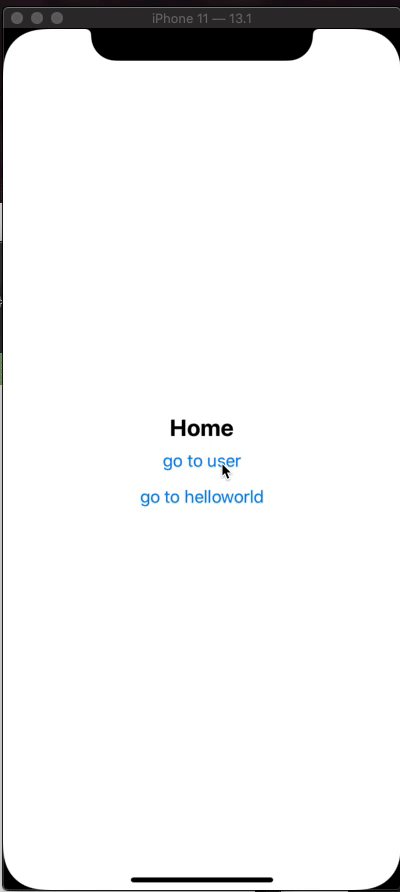
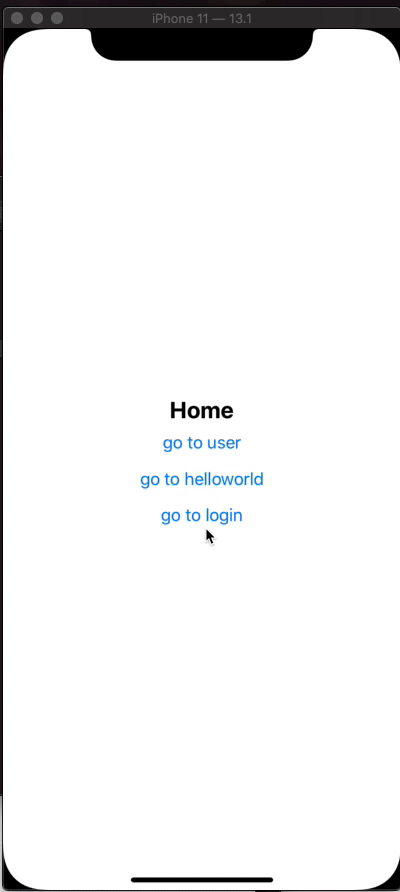
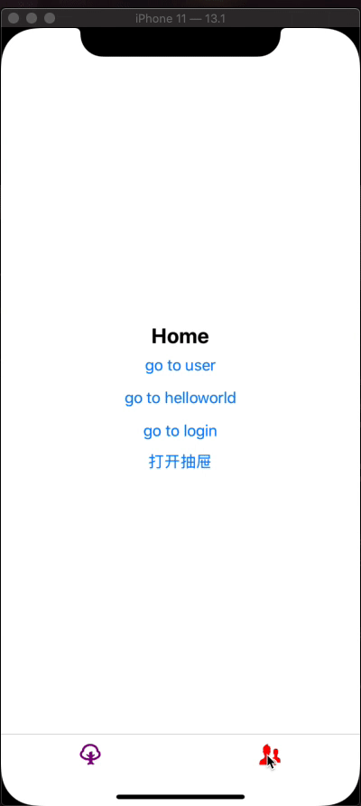
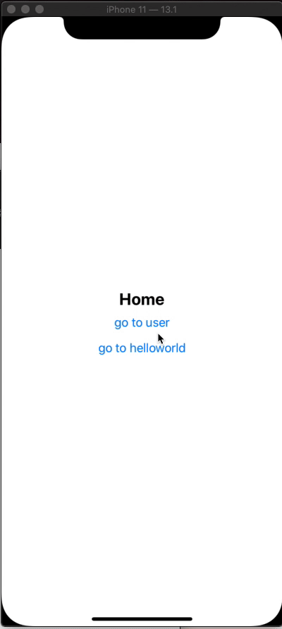

# 《React-Native 从入门到放弃》 \(二\) ———— 路由篇

### 前言

回忆一下前一篇，我们初步建立了`RN`的架子，并体验了一下`react-navigation`给我们作为路由管理的多页面样子。有些看官也许会说，你贴代码完全没有教程的意思~ 嘛~这章，根据一些我们常用的场景来展开讲一些`react-navigation`里的`api`。由于我并不会把所有的`api`都拉出来讲一遍，所以配合\`react-navigation\`官网\[1\]的文档食用更佳。

### 页面栈

> `react-navigation`的页面栈管理大致上分为\(我自己分的\): `stack`\(常见也是基础的栈\)、`switch`\(常用于授权，或者是登录等权限切换栈\)、`Drawer`\(抽屉式路由\)、`tabbar`\(即常见的 tabbar\) 。

#### `StackNavigator`

```text
# 使用前需安装依赖:
yarn add react-navigation-stack
```

`src->router.js`中为最常规的一个`StackNavigator`的例子。接下来我们来丰富一下它。

```text
const AppNavigator = createStackNavigator(
  {
    ...
  },
  {
    initialRouteName: 'Home',
    mode: 'modal', // 默认为card(即默认使用两端独有的页面切换方式), modal的方式则为从底部弹出的页面切换方式
    headerMode: 'screen', // 如何渲染header, 默认mode为card=>float, modal => screen, 若不需要header写为none即可
    headerLayoutPreset: 'center', // android默认为left, 消除差异则全部统一为center
    cardOverlayEnabled: true,
    transitionConfig: () => ({ // 自定义页面切换效果，并合并至当前的切换效果中
      transitionSpec: {
        duration: 300,
        easing: Easing.out(Easing.poly(4)),
        timing: Animated.timing,
      },
      screenInterpolator: sceneProps => {
        const { layout, position, scene } = sceneProps;
        const { index } = scene;

        const height = layout.initHeight;
        const translateY = position.interpolate({
          inputRange: [index - 1, index, index + 1],
          outputRange: [height, 0, 0],
        });

        const opacity = position.interpolate({
          inputRange: [index - 1, index - 0.99, index],
          outputRange: [0, 1, 1],
        });

        return { opacity, transform: [{ translateY }] };
      },
    }),

    defaultNavigationOptions: {
      ...
    }
  }
)
```



#### `SwitchNavigator`

在上面的例子里我们添加一个`stack`

```text
# src -> router.js
import { createAppContainer, createSwitchNavigator } from 'react-navigation'

const LoginNavigator = createStackNavigator(
  {
    Login: {
      screen: Login
    }
  },
  {
    mode: 'modal'
  }
)

const AppContainer = createAppContainer(createSwitchNavigator(
  {
    AppNavigator,
    LoginNavigator
  },
  {
    initialRouteName: 'AppNavigator'
  }
))

# 这样就可以实现一个路由栈的切换，并不会留下历史记录
```

switchNavigator demo

> 细心的看官肯定会发现，在两个路由栈之间切换的时候很生硬，一点页面切换的效果也没有，这个时候我们就需要用到，\`react-navigation-animated-switch\`\[2\], 下面只简单的给出一个示例，大家还可以根据传送门来开发更多好看的切换效果

```text
# 先安装必要依赖
yar add react-navigation-animated-switch
```

```text
# src -> router.js
import createAnimatedSwitchNavigator from 'react-navigation-animated-switch'
import {
  Transition
} from 'react-native-reanimated'
const AppContainer = createAppContainer(createAnimatedSwitchNavigator(
  {
    AppNavigator,
    LoginNavigator
  },
  {
    initialRouteName: 'AppNavigator',
    transition: (
      <Transition.Together>
        <Transition.Out
          type="slide-top"
          durationMs={400}
          interpolation="easeIn"
        />
        <Transition.In type="slide-bottom" durationMs={500}/>
      </Transition.Together>
    ),
  }
))
# 官方为大家提供了部分可用的变换效果即type属性:  fade, scale, slide-top, slide-bottom, slide-left, slide-right
```



#### `DrawerNavigator`

在很多`APP`中我们经常会看到一些点击某个按钮出现抽屉式的页面并导航到对应的页面中。接下来我们要讲述的则为实现此效果。下面只列举了部分配置，更多配置请点击DrawerNavigator 配置\[3\]

```text
# 安装依赖
yarn add react-navigation-drawer
```

```text
# src -> router.js
import { createDrawerNavigator } from 'react-navigation-drawer'

const AppContainer = createAppContainer(
  createDrawerNavigator(
    {
      AppNavigator,
      LoginNavigator
    },
    {
      drawerType: 'slide', // 滑动时背景页面的行为方式
      drawerPosition: 'right', // 抽屉的位置，默认为left
      drawerBackgroundColor: '#000000F6', // 抽屉背景色
      contentOptions: { // 设置抽屉内的每个条目样式
        activeTintColor: '#fffccd',
        inactiveTintColor: '#f67676'
      }
    }
  )
)

# 页面中打开抽屉 src -> pages -> home -> index.js
<Button onPress={ () => navigation.openDrawer() } title='打开抽屉' />
```


#### `Tabbar`

这个是`APP`中也是`H5`中最常见的底部选卡的路由方式。下面只列举了部分配置，更多配置请点击BottomTabNavigator 配置\[4\]

```text
# 安装
yarn add react-navigation-tabs
```

```text
# src -> router.js
import { createDrawerNavigator } from 'react-navigation-drawer'

const BottomNavigator = createBottomTabNavigator(
  {
    HomeTab: {
      screen: HomeScreen,
    },
    UserTab: {
      screen: UserScreen
    }
  },
  {
    defaultNavigationOptions({ navigation }) {
      const tabBarIcon = (options) => {
        const { focused, tintColor } = options
        console.log('icon', options)
        const {
          state: {
            routeName = ''
          } = {}
        } = navigation
        return <Icon
                  color={ tintColor }
                  name={ routeName === 'HomeTab' ? 'tree' : 'users' }
                  size={ 24 }
              />
      }
      return {
        tabBarIcon
      }
    },
    tabBarOptions: { // tabbar的一些配置
      activeTintColor: 'purple',
      inactiveTintColor: 'red',
      showLabel: false, // 是否展示routeName
    },
    /**
     * tabBarComponent: RE // 自定义Tabbar
     */
  }
)

const AppContainer = createAppContainer(
  createDrawerNavigator(
    {
      BottomNavigator,
      SwitchNavigator
    },
    {
      drawerType: 'slide', // 滑动时背景页面的行为方式
      drawerPosition: 'right', // 抽屉的位置，默认为left
      drawerBackgroundColor: '#000000F6', // 抽屉背景色
      contentOptions: { // 设置抽屉内的每个条目样式
        activeTintColor: '#fffccd',
        inactiveTintColor: '#f67676'
      }
    }
  )
)
```



### 页面构成

#### 解析页面构成

> 我们来根据图片来解析一个基本页面的构成

  
 从上图我们可以看出页面主要分为两个部分：


* `header`: 主要承载了我们的页面标题、 以及二级页面的导航返回一些导航相关的操作按钮等等。
* `container`: 内容部分, 这里面主要就是我们的页面的主体内容。

  > 这里注意: 这不是绝对的划分，因为`header`是可有可无的，我们可以通过配置来抹除它。当然在标准的`tab`页还会存在底部的`tabbar`, 所以这些划分并不是绝对的。 但是这个构成是在`react-navigation`中每个页面的基础样子。

#### 配置`Header`

> 这个配置是通用的，在接下来的每个场景里都是通用的。 所以属性会放在最下面统一来说  
>  在讲述配置的时候，我们要提前说一下可以添加配置的地方都有哪些~这里附赠官网配置\`header\`传送门\[5\]以及\`header\`详细属性文档\[6\]。搭配本小节讲解食用更佳。

* 页面内部:

```text
# src -> pages -> home -> index.js
import React, {
  useCallback
} from 'react'

import {
  SafeAreaView,
  Text,
  Button
} from 'react-native'

import styles from '../helloWorld/index.style'

const Home = ({
  navigation
}) => {

  const navigationTo = useCallback(() => {
    navigation.navigate('User')
  }, [])

  return (
    <SafeAreaView style={ styles.flexContainer }>
      <Text style={ styles.flexText }>Home</Text>
      <Button onPress={ navigationTo } title='go to user' />
    </SafeAreaView>
  )
}

+ Home.navigationOptions = {
  title: '这是一个标题'
}

export default Home

# 如果是class的写法直接在class内写增加的部分即可，无需Component.xxxx
class Home extends React.Component {
  static navigationOptions = {
    title: '这是一个标题'
  }

  render() {

  }
}
```


* 建立页面栈时单独对当前页面设置`header`

```text
# src -> router.js
const AppNavigator = createStackNavigator(
  {
    Home: {
      screen: HomeScreen,
      + navigationOptions({ navigation }) {
        return {
          title: '这是HomeScreen'
        }
      }
    },
    User: {
      screen: UserScreen
    }
  },
  {
    initialRouteName: 'Home'
  }
)
```


* 统一配置当前页面栈内的所有页面`header`属性

```text
# src -> router.js
const AppNavigator = createStackNavigator(
  {
    Home: {
      screen: HomeScreen
    },
    User: {
      screen: UserScreen
    }
  },
  {
    initialRouteName: 'Home',
    + defaultNavigationOptions: {
      title: '通用title'
    }
  }
)
# 这里敲黑板: 注意我使用的是4.x的`react-navigation`, 如果你使用的是之前的版本，请用`navigationOptions`来替代`defaultNavigationOptions`。
```


> 既然可以在三个地方配置`header`的样式，那么大家就比较关心的是，它们的优先级是怎么确定的，哪个才是最终呈现在页面上的样子。  
>  他们的优先级为: `Stack.defaultNavigationOptions` -&gt; `Component.navigationOptions` -&gt; `stack.screen.navigationOptions`。

知道优先级的大家就知道如何来使用它们来达到自己所需要的效果了。  
 常见配置项:\(下面用`RE`来代替`React Element`, `[ 'attribute1' || 'attribute2' ]`这个写法是说这个地方这两个属性需要的值和配置是相同的\)

```text
{
  title: '', // string 页面中部的标题
  headerTitle: ({
    children: title = '', // 这个为我们设置的title属性
    allowFontScaling = false, // 是否允许文字随系统字体缩放
    style = [], // 标题的样式
  }) => <Text style={ style }>{ title }</Text>, // RE
  header['Left'||'Right']: () => RE, // RE, 需要注意的是: 当设置headerLeft的时候可以接收到一个参数含有onPress(左边按钮事件)、title(返回到上一级的title)、 titleStyle。
  headerStyle: {}, // 整个header的样式, 与之关联的还有headerBackground(设置header背景色)、headerTransparent(header是否为透明)、headerBackgroundTransitionPreset(header在切换页面的过程中背景色的变化方式)、headerTintColor(header内所有元素的颜色)
  header['TitleStyle' || 'BackTitleStyle' || 'LeftContainerStyle' || 'RightContainerStyle' || 'TitleContainerStyle']: {}, // styleObject, 根据属性名称对号入座，分别配置不同位置的元素的样式属性。
  headerTruncatedBackTitle: '', // string, 决定下一级页面返回按钮label中的title内容
  headerTitleAllowFontScaling: false, // boolean, 这个是决定title的字体是否随系统的字体变化而变化
  header: null || () => RE, // 自定义渲染整个header,接收可配置的所有参数, 若设置为null, 则不显示header, 即不占据页面空间，与headerShown设置为false效果相同。
}
```

下面为一个完整的示例\(为方便展示我放在 router.js 中统一配置\):

```text
const AppNavigator = createStackNavigator(
  {
    Home: {
      screen: HomeScreen,
      navigationOptions({ navigation }) {
        return {
          headerShown: false,
          headerBackTitle: '回到Home'
        }
      }
    },
    ...
  },
  {
    initialRouteName: 'Home',
    defaultNavigationOptions: {
      title: 'React-Native',
      headerTintColor: '#FFFFFF',
      headerLeft(options) {
        const {
          title = '',
          onPress = void(0),
          titleStyle = {},
          tintColor = '#000000',
          backImage = null
        } = options
        const extStyle = {
          color: tintColor
        }
        return (
          <TouchableOpacity
            onPress={ onPress }
          >
            <View style={ { flex: 1, alignItems: 'center', flexDirection: 'row' } }>
              <Image source={ backImage || require('./img/backblack.png') } style={ { width: 32, height: 32 } }/>
              <Text style={ [ titleStyle, extStyle ] }>{ title }</Text>
            </View>
          </TouchableOpacity>
        )
      },
      headerRight() {
        return <Text style={ { color: '#FFFFFF' } }>customer right</Text>
      },
      headerRightContainerStyle: {
        paddingRight: 12
      },
      headerStyle: { backgroundColor: '#1890ff' }
    }
  }
)
```



#### `Container`

内容部分完全可以按照自己的开发习惯来分配，这里不做多讲~只需要注意的是`IOS`和`AndroidX`开发的时候最好在页面的外围包一个`SafeAreaView`来获取安全区域\(即去掉额头和下巴\)。

### 小结

以上介绍了常用的路由模式以及页面的基础构成，虽然没有细节到每一个属性和方法，但是常用的一些属性我都有提及，如果还是有不懂的地方，那么可以提个`issue`或者留个言。  
 `react-navigation`还有一些`actions`没有提及到，因为要和`redux`配合使用。在下一节状态管理里对应添加对应的部分。

#### 参考资料

 \[1\]

`react-navigation`官网: _https://reactnavigation.org/docs/en/getting-started.html_ \[2\]

`react-navigation-animated-switch`: _https://software-mansion.github.io/react-native-reanimated/getting-started.html_ \[3\]

DrawerNavigator配置: _https://reactnavigation.org/docs/en/drawer-navigator.html_ \[4\]

BottomTabNavigator配置: _https://reactnavigation.org/docs/en/bottom-tab-navigator.html_ \[5\]

官网配置`header`传送门: _https://reactnavigation.org/docs/en/headers.html_ \[6\]

`header`详细属性文档: _https://reactnavigation.org/docs/en/stack-navigator.html\#navigationoptions-for-screens-inside-of-the-navigator_

